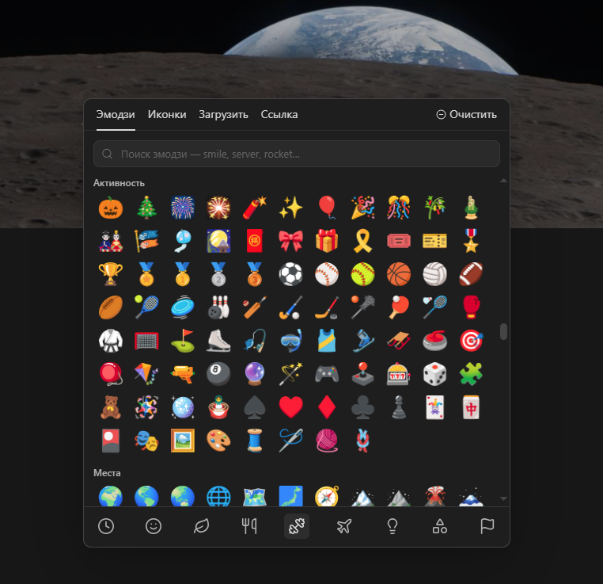
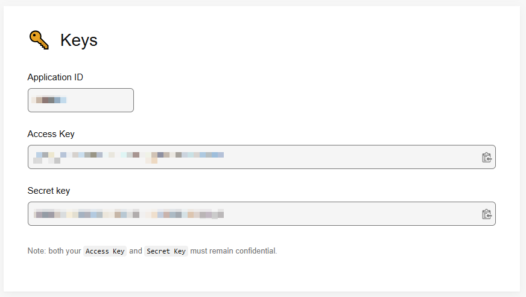

# NaitFlow

**English** | [Русский](README_RU.md)

NaitFlow — Notion UI for Obsidian

An Obsidian plugin that adds a Notion-style page sidebar, emoji/icons, and page covers.

## Features

- visual emoji picker with categories, search, and recent items;
- built-in Lucide icon browser;
- custom icon uploads and direct image links;
- page icons above titles, in the NaitFlow tree, and in tabs;
- local cover gallery featuring NASA, Webb, Artemis II, MET Open Access, and gradients;
- cover uploads from your computer, direct links, or Unsplash search;
- drag-to-reposition cover images vertically;
- virtual nested pages through `naitflow-parent`, without turning notes into folders;
- automatic English and Russian interface based on the Obsidian language.

## Manual installation

Copy `main.js`, `manifest.json`, `styles.css`, `NotoColorEmoji.ttf`, `NotoColorEmoji-LICENSE.txt`, and the `presets` directory into `.obsidian/plugins/naitflow`. Restart Obsidian, then enable NaitFlow under **Community plugins**.

Development and publishing notes are available in [PUBLISHING.md](PUBLISHING.md) (Russian).

## Unsplash search

NaitFlow does not ship with a shared Unsplash key. To enable cover search for personal use:

1. Sign in to [Unsplash Developers](https://unsplash.com/oauth/applications/new).
2. **Verify your Unsplash account email before creating an application.** Without verification, submitting the name and description may appear to do nothing.
3. Return to [New Application](https://unsplash.com/oauth/applications/new), read the API terms, and accept them.
4. Create an application using, for example:
   - **Application name:** `NaitFlow`
   - **Description:** `Cover image search and selection for the NaitFlow Obsidian plugin.`
5. Open **Your apps → NaitFlow** and scroll to **Keys**. You will see an **Application ID**, **Access Key**, and **Secret Key**.

   

6. Copy only the **Access Key**. NaitFlow does not need the Application ID or Secret Key.
7. In Obsidian, open **Settings → NaitFlow → Unsplash Access Key** and paste the key.

Never publish the **Secret Key** in NaitFlow, screenshots, discussions, or GitHub. The Access Key is stored in this vault's plugin settings (`.obsidian/plugins/naitflow/data.json`), so treat that file and synchronized copies as confidential too.

New Unsplash applications start in demo mode with a limited request allowance. This personal-key setup is intended for local use and development. A shared key must not be embedded in the plugin because distributed files, including `main.js`, are visible to users and cannot keep a key secret.

References: [Unsplash API documentation](https://unsplash.com/documentation) and [Unsplash API guidelines](https://help.unsplash.com/en/articles/2511245-unsplash-api-guidelines).

## Sources and licenses

The bundled [Google Noto Color Emoji](https://github.com/googlefonts/noto-emoji) font is distributed under the SIL Open Font License 1.1. Its license text is included as `NotoColorEmoji-LICENSE.txt`.

Sources for bundled covers are listed in `SOURCES.md` files inside the preset directories. NASA imagery is used for informational purposes and does not imply NASA endorsement. Bundled MET works are public-domain assets published through the MET Open Access program.
